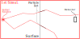

Introduction
============

Surface sources in Monte Carlo radiation transport
--------------------------------------------------

Monte Carlo radiation transport codes simulate the propagation of individual particles, from their birth at the source until they are absorbed or leave the simulation region. To estimate the flux in the region of interest, a tally of each particle reaching a (virtual) detector is recorded. A problem arises when the region of interest is too far away from the source, or behind a shield, since very few particles reach the detector, and therefore the recorded tally lacks statistical precision. Variance reduction methods are a family of techniques that help preferentially propagating radiation towards the detector, preserving the underlying physics.

Distributional surface sources offer a solution for the previously described problem. The approach consist in 3 steps:

* 1st step: Record a surface source in an intermediate region of a simulation. The surface source consist in a particle list with the properties (position, direction, energy, time, etc.) of all particles crossing the chosen surface.

	1st step: Record particle list.

* 2nd step: Convert particle list to distributional source. There are several density estimation methods. One of the easiest of them is histograms, but there are others, such as Kernel Density Estimation (KDE), that allow a smooth source distribution. It is important to remember that source distribution is multidimensional, with correlation between variables.

	1st step: Create distributional source.

* 3rd step: Use distributional source in a second simulation, generating an unlimited number of new particles. Since the surface source is closer to the detector than the initial source, more particles can reach it, improving the tally precision. The distributional nature of the source ensures that source particles are not repetitions of the particles in the particle list.

	1st step: Use distributional source

Besides improving tally precision, surface sources are useful in neutron beams calculations. In this case, beams are transported from the reactor core or accelerator-based source to the instrument of interest, with a negligible flux of neutrons in the opposite direction. It is therefore possible to record a single surface source at a beam entry, and use it to simulate several different instruments at the beam end, without having to repeat the core simulation.

Kernel Density Estimation (KDE)
-------------------------------

KDSource uses the adaptive multivariate Kernel Density Estimation (KDE) method to convert particle lists in distributional sources. It allows a soft representation of distributions, while preserving correlations between variables. It is easy to automatically fit to a given particle list, and after that the obtained model can be used to efficiently produce an unlimited number of new particles.

In KDE, a kernel function (gaussian distribution, for example) is placed on each particle of the particle list. Then all kernels are summed, obtaining the estimated density. The bandwidth of the kernel (standard deviation of gaussian distribution, for example) controls the degree of softening. The two main parameters of KDE are the kernel function and the bandwidth. While the kernel function is usually chosen by the user, there are several methods to automatically optimize the bandwidth.

	Visual representation of KDE. A kernel function is centered on each particle, and the kernel distributions are summed.

KDE, in the version used in KDSource, has the following expression for the estimated density:

.. math::

	\hat{f}(\textbf{x}) = \hat{f}(x_{1},x_{2},...,x_{D}) =
	\sum_{i=1}^N w_i \left\{ \prod_{j=1}^D \frac{1}{h_i}
	K\left(\frac{x_j-(p_i)_j}{s_j h_i}\right) \right\}

Where:
	* :math:`x` is the phase-vector defining a source particle.
	* :math:`p_i` is the i-th particle in the particle list.
	* :math:`D` is the number of particle parameters
	* :math:`w_i` is the weight corresponding to the i-th particle in the particle list.
	* :math:`K` is the kernel function (standard gaussian).
	* :math:`h_i` is the bandwidth corresponding to the i-th particle in the particle list.
	* :math:`s_j` is the scaling factor for variable :math:`j`, which by default is the standard deviation of the component :math:`j` of the particle list.

Particle generation is very straight-forward in KDE. New particles are generated by applying perturbations on particles from the particle list, with perturbation vectors chosen randomly following the kernel distribution:

.. math::

	\tilde{p} = p_i + \delta,\ \ \ \delta \sim K_{h_i}

Where:
	* :math:`\tilde{p}` is the generated particle.
	* :math:`p_i` a particle sampled from the particle list.
	* :math:`\delta` is a perturbation vector following the kernel distribution.

The KDSource implementation
---------------------------

The KDSource tool automatizes this workflow for some of the most used Monte Carlo transport codes, such as MCNP, PHITS, Geant4, McStas, McXtrace, TRIPOLI-4 and OpenMC. It internally uses the MCPL format for particle lists, which allows converting between particle lists formats with freedom. KDSource consist has the following main components:

	* Python API: For distributional source fitting. From the Python API you can load a particle list recorded in any compatible Monte Carlo code, and create and fit a KDE distributional source. The source parameters are saved in a XML file.
	* Command-line API: For easy particle generation, using a previously generated and fitted source. You can generate an unlimited number of new particles and save them in a new MCPL file, which can be later converted to other particle list format to be used as input of a simulation.
	* C API: For greater control on particle generation. Using the C API you can couple a KDE source with C-based Monte Carlo codes such as McStas or TRIPOLI-4 creating an on-the-fly source, i.e. a source that generates particles while the simulation executes, without storing them in a new MCPL file.

The KDSource workflow is depicted in the following figure. The procedure is based on the idea described in the first section of the Introduction.

	Scheme of the KDSource workflow.
